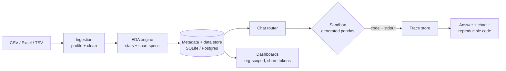
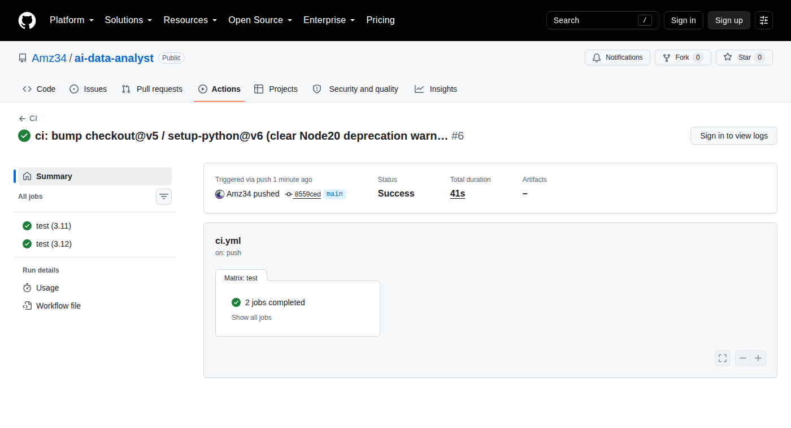

# AI Data Analyst

**Ask your data. Get answers.**

[](https://github.com/Amz34/ai-data-analyst/actions/workflows/ci.yml)
[](https://www.python.org/downloads/)
[](https://fastapi.tiangolo.com/)
[](#verified-numbers)
[](LICENSE)
[](#fork-it-and-make-it-yours)

---

## The 40-hour week nobody talks about

Every data team knows the loop:

> **"Can you pull that number real quick?"**
> → open the CSV → fight the encoding → guess the delimiter → 14 columns of mixed types
> → `df.info()` → rewrite the cleaning script → plot → get asked *"but by region?"*
> → rebuild → paste a screenshot into Slack → repeat next Tuesday.

It is not hard work. It is **unbilled work**, and it is ~60% of an analyst's calendar.

This repository is my answer: a self-hosted analyst that takes a raw business file
(CSV / Excel / TSV) and walks the entire path itself — **profile → clean → EDA →
interactive dashboard → plain-language answers** — while keeping every step auditable,
reproducible and *yours*.

No SaaS account. No data leaving your machine unless you point it at a cloud model.
No "trust me" black box: every answer carries the code that produced it.
---

## What it actually does

Upload a messy file. The service:

1. **Profiles it** — dtype inference, null maps, cardinality, duplicate rows, outlier
   flags, date detection, and a data-quality score you can act on.
2. **Cleans it** — safe, declared-at-runtime transformations (type coercion, header
   normalisation, whitespace, currency/percent stripping) so the dataset survives
   downstream analysis.
3. **Explores it** — automatic EDA: distributions, correlations, group-by summaries,
   time-series trends, and chart specs chosen per column type.
4. **Builds dashboards** — saved, org-scoped dashboards your team can open, filter
   and re-share (share-token links) without touching code.
5. **Answers questions** — *"which region grew fastest last quarter?"* → the model
   writes pandas, the **sandbox** executes it, the **trace** records it, and you get
   the answer, the chart, and the exact code.

> The chat is the interface. The sandbox + trace are the reason you can put it in
> front of a client.

## 60-second quickstart

```bash
git clone https://github.com/Amz34/ai-data-analyst.git
cd ai-data-analyst
python3 -m venv venv && source venv/bin/activate
pip install -r requirements.txt

cp .env.example .env          # SQLite by default; add an LLM key for /ask, or leave blank
uvicorn app.main:app --reload --port 8001
```

Open <http://127.0.0.1:8001> → register → upload a CSV → ask it something.

**Zero-config path:** the default `.env` uses a local SQLite file and creates its own
tables on boot — no Postgres, no Docker, no migrations. Point `DS_DB_URL` at Postgres
(`pip install psycopg2-binary`) when you want the multi-tenant shape.

```bash
pytest -q          # 38 tests, ~35s, no network, no credentials
```

## API surface (the boring part that makes it real)

| Method | Path | What it does |
| --- | --- | --- |
| `GET` | `/api/health`, `/api/healthz` | Liveness + readiness |
| `POST` | `/api/auth/register`, `/api/auth/login` | JWT auth (org-scoped) |
| `GET` | `/api/auth/me` | Current user + organisation |
| `GET` | `/api/billing/plans`, `/api/billing/me` | Plan tiers + this org's plan |
| `GET` | `/api/admin/orgs` | All orgs (admin token) |
| `POST` | `/api/admin/orgs/{id}/plan` | Plan change |
| `POST` | `/api/datasets/upload` | Ingest CSV / Excel / TSV (profiled + cleaned) |
| `GET` | `/api/datasets`, `/api/datasets/{id}` | List / fetch dataset metadata |
| `GET` | `/api/datasets/{id}/preview` | Paged preview after cleaning |
| `GET` | `/api/datasets/{id}/eda` | Full EDA payload (stats + chart specs) |
| `POST` | `/api/datasets/{id}/ask` | Question → pandas code → sandboxed result + answer |
| `POST` | `/api/datasets/{id}/dashboard` | Materialise a dashboard from a dataset |
| `GET` | `/api/dashboards`, `/api/dashboards/{id}` | List / open saved dashboards |
---

## Architecture (and why each gate exists)



Four decisions I will defend in a code review:

**1. The model never touches your data directly.**
It writes code; the **sandbox** runs it against the dataset with a bounded
execution context. The model cannot "hallucinate a number" — the number comes out
of pandas, not out of a language model.

**2. Every answer is traceable.**
`app/services/trace.py` persists the generated code, the result, and the timing, so
"why does this dashboard say 12%" is a query, not an argument.

**3. Ingestion is deterministic; interpretation is probabilistic.**
Cleaning and EDA are plain pandas/polars-style code paths with declared rules. Only
the *question → code* step is LLM-driven. That split keeps regressions testable —
which is why the suite runs in ~25s with no network access.

**4. Multi-tenant from day one.**
Users live inside organisations, datasets and dashboards are org-scoped, and share
links use explicit tokens. Retrofitting tenancy later is how internal tools die.

## Verified numbers

I do not put unverifiable claims in a README. Everything below is reproducible:

| Claim | How to check it |
| --- | --- |
| 38 tests pass, 0 failures | `pytest -q` (~35s, no network) |
| 1,443 lines of app code + 511 lines of tests | `find app tests -name "*.py" \| xargs wc -l` |
| Zero external services needed for dev | SQLite default in `tests/`, no Docker |
| Endpoints as documented | `/docs` (FastAPI OpenAPI), `/openapi.json` |
---

## Build proof

The badge at the top is live; here is the receipt. Current `main`, both runtimes, zero skipped tests:

<details>
<summary><b>CI run #6 — Success, 2/2 jobs, 41s</b> (Python 3.11 + 3.12)</summary>



</details>

Reproduce it locally, offline, with no credentials:

```bash
pip install -r requirements.txt
pytest -q                                     # 38 passed
python -m uvicorn app.main:app --port 8001    # then open http://127.0.0.1:8001
```

## Fork it and make it yours

This is the part most repos get wrong. A repo you cannot run in five minutes is a
screenshot, not a tool.

- **Fork it** → point it at *your* warehouse, *your* model endpoint, *your* branding.
  The whole analysis layer is plain Python you can read in one sitting.
- **Swap the model** — `app/services/llm.py` is one adapter. DeepSeek, GPT, Claude,
  a local Ollama box: same interface.
- **Extend the analysis** — `app/services/eda.py` and `charts.py` are where new
  statistical tests and chart specs belong. Good first issues below.

If you fork it, star it too — that is how the next analyst finds it instead of
rebuilding it at 2am.

### Good first issues

- [ ] Excel multi-sheet ingestion (pick a sheet, keep the rest addressable)
- [ ] Arabic / RTL dashboard labels (`ui.lang` is already threaded through)
- [ ] Anomaly detection pass (isolation forest) with an explainability column
- [ ] Export a dashboard to a scheduled PDF/email digest
- [ ] DuckDB backend for files larger than memory

## Roadmap

- [x] Auth, orgs, plan tiers, org-scoped data
- [x] Ingestion, profiling, cleaning, EDA, chart specs
- [x] Sandboxed code execution + trace store
- [x] Dashboards with share tokens
- [ ] Weekly scheduled reports (PDF → inbox)
- [ ] Semantic layer so "revenue" means the same thing in every answer
- [ ] Row-level permissions

## If you would rather not run it yourself

Self-hosting is the honest default here — your data stays yours. But not every team
wants to own a box, a model key, and the upgrades:

- **Hosted, on your cloud or mine** — same codebase, wired into your warehouse,
  with your SSO and your retention rules.
- **Integration work** — connecting this to an existing BI stack, ERP export, or an
  internal data platform instead of replacing it.
- **Sponsorship** — if this saved you a sprint, GitHub Sponsors keeps the roadmap
  moving; commercial support comes with a real SLA.

Reach out through my GitHub profile (<https://github.com/Amz34>) — a two-line note
about your data setup is enough for a straight answer about fit, cost, and timeline.
No forms, no "book a demo" theatre.

## Contributing, security, license

- Contributions: open an issue first for anything larger than a bug fix — I would
  rather agree on the interface than review a rewrite.
- Security: no secrets in this repo, ever (see `.env.example`). Report anything
  sensitive privately rather than in a public issue.
- **License: MIT** — use it, ship it, sell it. Keep the copyright notice.

---

*Built from a working analyst's workflow, not a demo script. If the quickstart fails
on your machine, that is a bug worth reporting — open an issue with your OS and
Python version.*
